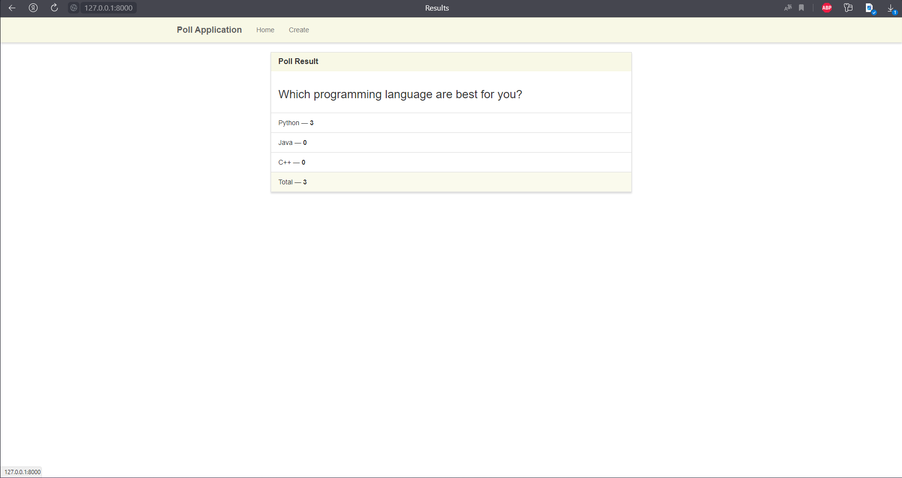

# Poll APP in Django
This is a simple poll application built with Django/Html/Css. It allows users to create polls,vote on them, and view the results.
## Instalaton
1. Clone this repository: `git clone https://github.com/xusraw1/poll-app.git`
2. Open project in terminal by using: `cd poll-app`
3. Install Django: `pipenv install django`
4. Activate the virtual environment: `pipenv shell`
5. Run database migrations: `python manage.py migrate`
## Usage
1. Runserver: `python manage.py runserver`
2. Open web-site in your brauzer: `127.0.0.1:8000` or `http://localhost:8000`

## Poll-app Images

Thanks for watching `❤️`